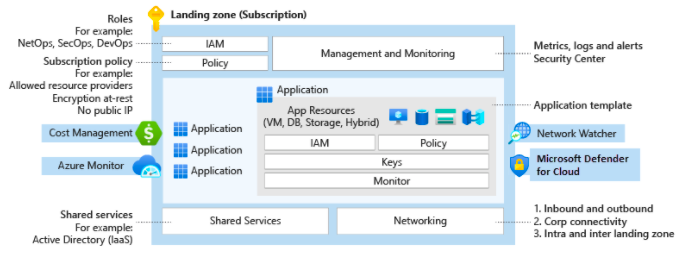
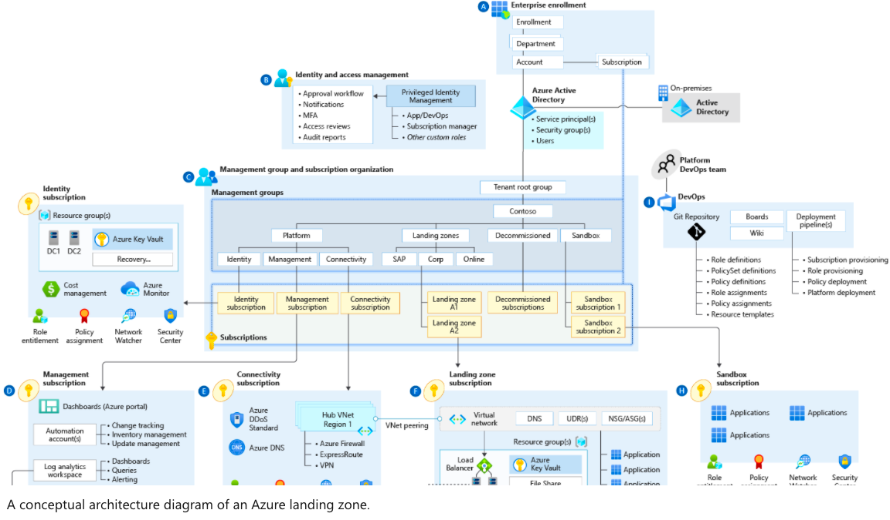
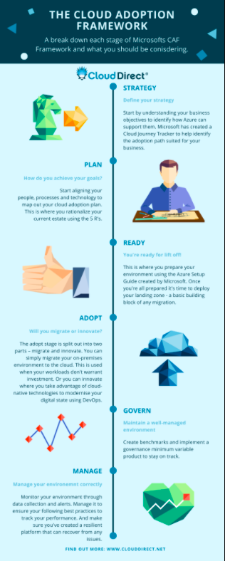
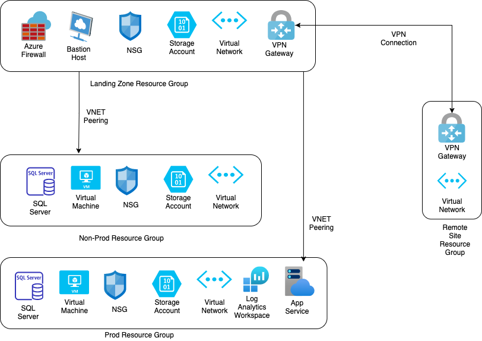

# What is an Azure Landing Zone ?

Azure landing zones are the output of a multisubscription Azure environment that accounts for scale, security governance, networking, and identity. Azure landing zones enable application migration, modernization, and innovation at enterprise-scale in Azure. These zones consider all platform resources that are required to support the customer's application portfolio and don't differentiate between infrastructure as a service or platform as a service.



Here's what Microsoft Official Article says about a landing Zone - [Watch it Here](https://www.microsoft.com/en-us/videoplayer/embed/RE4xdvm?postJsllMsg=true)

## Features of Azure Landing Zone

1. Scalable

All Azure landing zones support cloud adoption at scale by providing repeatable environments, with consistent configuration and controls, regardless of the workloads or Azure resources deployed to each landing zone instance.

2. Modular

All Azure landing zones provide a modular approach to building out your environment, based on a common set of design areas. Each design area can be easily extended to support the distinct needs of various technology platforms like Azure SQL Database, Azure Kubernetes Service, and Azure Virtual Desktop.

## Azure landing zone conceptual architecture

For many organizations, the Azure landing zone conceptual architecture below represents the destination in their cloud adoption journey. It's a mature, scaled-out target architecture intended to help organizations operate successful cloud environments that drive their business while maintaining best practices for security and governance.

This conceptual architecture represents scale and maturity decisions based on a wealth of lessons learned and feedback from customers who have adopted Azure as part of their digital estate.

While your specific implementation might vary, as a result of specific business decisions or existing investments in tools that need to persist in your cloud environment, this conceptual architecture will help set a direction for the overall approach your organization takes to designing and implementing a landing zone.



# What is Cloud Adoption Framework ?

The Cloud Adoption Framework (CAF Framework) is a collection of documentation, implementation guidance, best practices, and tools that are proven guidance from Microsoft designed to accelerate your cloud adoption journey. There are six stages to the CAF framework, and each stage has been crafted to help you accelerate your cloud adoption journey. Think of the CAF framework as your guide to making the most of your Azure investment.

It’s important to note that the CAF framework isn’t just for businesses that are new to the cloud, it can be used by businesses at any stage of their cloud journey. And we’re here to help you understand how you can start using it.

## What are the six stages of the Cloud Adoption Framework?

1. Strategy

Start by understanding your business objectives to identify how Azure can support them. Microsoft has created a Cloud Journey Tracker to help identify the adoption path suited for your business.

2. Plan

Start aligning your people, processes, and technology to map out your cloud adoption plan. This is where you rationalize your current estate using the 5 R’s of application modernisation.

3. Ready

This is where you prepare your environment using the Azure Setup Guide created by Microsoft. Once you’re all prepared it’s time to deploy your landing zone – a basic building block of any migration.

4. Adopt

The adopt stage is split out into two parts – migrate and innovate. You can simply migrate your on-premises environment to the cloud. This is used when your workloads don’t warrant investment. Or you can innovate where you take advantage of cloud-native technologies to modernise your digital state using DevOps.

5. Govern

Create benchmarks and implement a governance minimum variable product to stay on track. Working with an Azure Expert MSP can help you govern your environment, helping you maintain your progress.

6. Manage

Monitor your environment through data collection and alerts. Manage it to ensure your following best practices to track your performance. And make sure you’ve created a resilient platform that can recover from any issues.



References : [What is Cloud Adoption Framework](https://www.clouddirect.net/what-is-the-cloud-adoption-framework/)


# Going through the Terraform code

The Terraform project is configured to work on the following principle

- The **main.tf** creates all the Resource Groups, and calls the module from modules directory.
- The **landingzone.auto.tfvars** contains values of all the variables. You need to exchange **"<Your Value Here>"** with your values.

## Some code examples

The provider config for backend. You need to replace "<Your Value here>" with your own values.

```
  backend "azurerm" {
    resource_group_name  = "<Your Value here>"
    storage_account_name = "<Your Value here>"
    container_name       = "<Your Value here>"
    key                  = "<Your Value here>"
  }
```

The **main.tf** file starts with creating the Resource groups.

```
resource "azurerm_resource_group" "alz-rg" {
  name     = var.alz_rg_name
  location = var.alz_rg_location
  tags     = var.tags
}

resource "azurerm_resource_group" "dev-rg" {
  name     = var.dev_rg_name
  location = var.dev_rg_location
  tags     = var.tags
}

resource "azurerm_resource_group" "prod-rg" {
  name     = var.prod_rg_name
  location = var.prod_rg_location
  tags     = var.tags
}

resource "azurerm_resource_group" "remote-rg" {
  name     = var.remote_rg_name
  location = var.remote_rg_location
  tags     = var.tags
}
```

Then it calls the modules to create the resources

```
module "alz" {
  source                          = "./modules/alz"
  alz_vn_name                     = var.alz_vn_name
  alz_vn_address                  = var.alz_vn_address
  alz_rg_name                     = azurerm_resource_group.alz-rg.name
  alz_rg_location                 = azurerm_resource_group.alz-rg.location
  alz_vn_subnet_name              = var.alz_vn_subnet_name
  alz_vn_subnet_address           = var.alz_vn_subnet_address
  alz_firewall_subnet_address     = var.alz_firewall_subnet_address
  alz_vn_gateway_subnet_address   = var.alz_vn_gateway_subnet_address
  alz_vn_bastion_subnet_address   = var.alz_vn_bastion_subnet_address
  alz_prod_vn_peering_name        = var.alz_prod_vn_peering_name
  prod_vn_id                      = module.prod.prod-vn-id
  alz_dev_vn_peering_name         = var.alz_dev_vn_peering_name
  dev_vn_id                       = module.dev.dev-vn-id
  alz_sa_name                     = var.alz_sa_name
  alz_sa_tier                     = var.alz_sa_tier
  alz_sa_replication_type         = var.alz_sa_replication_type
  alz_sa_container_name           = var.alz_sa_container_name
  alz_sa_container_access_type    = var.alz_sa_container_access_type
  alz_firewall_pip_name           = var.alz_firewall_pip_name
  alz_firewall_name               = var.alz_firewall_name
  alz_firewall_deny_ssh_rule_name = var.alz_firewall_deny_ssh_rule_name
  alz_vpn_pip_name                = var.alz_vpn_pip_name
  alz_vn_gateway_name             = var.alz_vn_gateway_name
  alz_remote_connection_name      = var.alz_remote_connection_name
  vn_gateway_shared_key           = var.vn_gateway_shared_key
  remote_vn_gateway_id            = module.remote.remote-vn-gateway-id
  alz_law_name                    = var.alz_law_name
  alz_law_sku                     = var.alz_law_sku
  alz_bastion_pip_name            = var.alz_bastion_pip_name
  alz_bastion_name                = var.alz_bastion_name
  tags                            = var.tags
}
```

An snipet of the tfvars file

```
// ALZ variable values
alz_vn_name                     = "alz-vn"
alz_vn_address                  = ["10.0.0.0/16"]
alz_vn_subnet_name              = "alz-subnet"
alz_vn_subnet_address           = ["10.0.1.0/24"]
alz_firewall_subnet_address     = ["10.0.2.0/24"]
alz_vn_gateway_subnet_address   = ["10.0.3.0/24"]
alz_vn_bastion_subnet_address   = ["10.0.4.0/24"]
alz_sa_name                     = "<Your Value Here>"
alz_sa_tier                     = "Standard"
alz_sa_replication_type         = "LRS"
alz_sa_container_name           = "alz-container"
alz_sa_container_access_type    = "private"
alz_prod_vn_peering_name        = "alz-prod-vn-peering"
alz_dev_vn_peering_name         = "alz-dev-vn-peering"
alz_firewall_pip_name           = "alz-firewall-pip"
alz_firewall_name               = "alz-firewall"
alz_firewall_deny_ssh_rule_name = "alz-firewall-deny-ssh-rule"
alz_vpn_pip_name                = "alz-vpn-pip"
alz_vn_gateway_name             = "alz-vn-gateway"
alz_remote_connection_name      = "alz-remote-vpn"
alz_law_name                    = "prod-law"
alz_law_sku                     = "PerGB2018"
alz_bastion_pip_name            = "alz-bastion-pip"
alz_bastion_name                = "alz-bastion"
```

## Resources that are created

The list of resources created by this Bicep Project are as follows : -

- General
    - Azure Policy to Allow only specific regions

- Landing Zone
    - Resource Group
    - Virtual Network, Subnets and Peering to Non-Prod Zone and Prod Zone
    - Azure Firewall with sample rules
    - Azure Bastian Host
    - Network Security Group with sample rules
    - Azure Storage Account
    - VPN Connection to Remote Site Zone

- Non Prod Zone
    - Resource Group
    - Virtual Network, Subnets and Peering to Landing Zone
    - Network Security Group with Sample rules
    - Azure Virtual Machine
    - Azure SQL Database
    - Azure Storage Account

- Prod Zone
    - Resource Group
    - Virtual Network, Subnets and Peering to Landing Zone
    - Network Security Group with Sample rules
    - Azure Virtual Machine
    - Azure SQL Database
    - Sample App Service
    - Log Analytics Workspace
    - Azure Storage Account

- Remote Site Zone (Read as On-Premise Network)
    - Resource Group
    - Virtual Network. Subnets
    - VPN Connection to Landing Zone
## Diagram

Here's a rough diagram of the resources it creates



## Run the code

### Authenticate Azure CLI

Hit the command **az login** from Comamnd Prompt or Terminal depending upon your OS. More details can be found [here](https://docs.microsoft.com/en-us/cli/azure/get-started-with-azure-cli)

### Trigger Manually

Fire the below command to create the resources using Bicep script

> terraform plan
> terraform apply